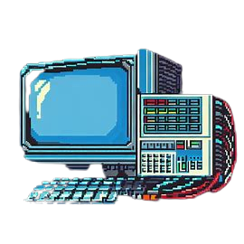

# SoK: Security of Programmable Logic Controllers: ICS<sup>2</sup> Matrix

<div align="center">
  <kbd>
    
  </kbd>
</div>
<br />

This repository hosts the ICS<sup>2</sup> Matrix released with the paper **SoK: Security of Programmable Logic Controllers**.

## What is the ICS<sup>2</sup> Matrix?

The ICS<sup>2</sup> Matrix is a taxonomy of threats against PLCs and
Industrial Control Systems (ICS). The taxonomy includes adversary tactics that describe “what” is the adversary’s goal and attack techniques which describe “how” the adversary can complete her goal. Additionally, it includes mitigations that prevent a technique from being successfully executed. The ICS2 Matrix builds upon the MITRE ATT&CK for ICS Matrix and the Hybrid ATT&CK Matrix. It also incorporates the scientific knowledge accumulated since 2007 of PLC security research by adding 6 new attack techniques and 5 new mitigation categories based on the literature reviewed in the SoK: Security of Programmable Logic Controllers paper.

## How do I use the ICS<sup>2</sup> Matrix?

:open_file_folder: [Matrix Excel File](ics2matrix.xlsx)

The matrix is contained in the above Microsoft Excel document. This format allows for easy distrition and navigation of the multiple techniques.
In order to use it you should download and open the Excel file and explore the "ICS2 Matrix" tab. This tab contains different techniques. The techniques are ordered by Tactic category.
The new techniques introduced in our research are saved as multiple tabs in the Excel document and are also linked from their corresponding technique in the "ICS2 Matrix" tab.

## How can I contribute to the ICS<sup>2</sup> Matrix?

## Research Paper

**SoK: Security of Programmable Logic Controllers** 

If you use our work in a scientific publication, please do cite us using this **BibTex** entry:
``` tex
@inproceedings{placeholder,
 author    = {placeholder},
 booktitle = {placeholder},
 title     = {placeholder},
 year      = {placeholder}
}
```

## Getting Started

Coming soon!

## Help

Coming soon!

## License

This project is licensed under the MIT License - see the LICENSE.md file for details

## Acknowledgments

Coming soon!
